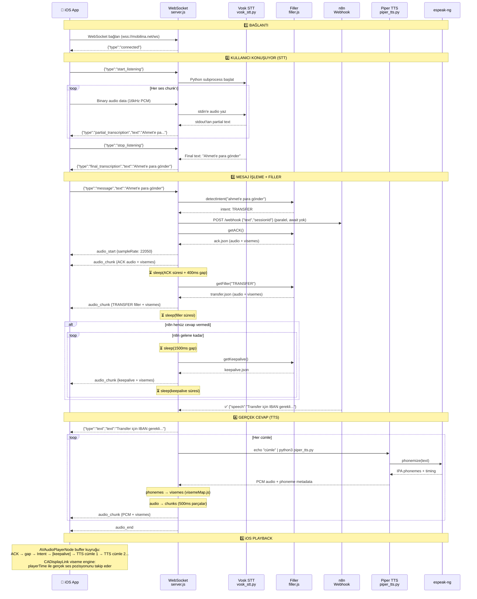
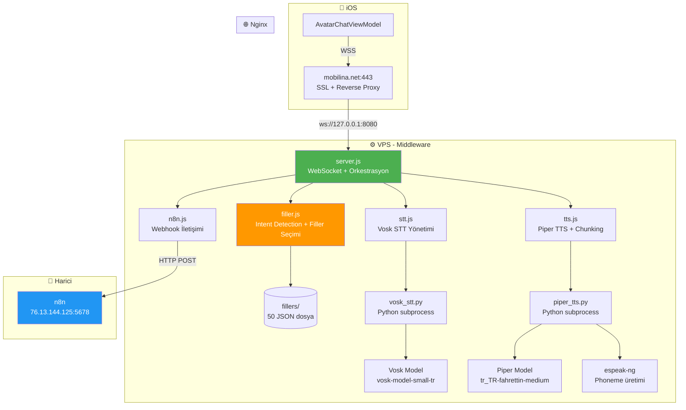

# ozan.

https://github.com/user-attachments/assets/aae64e30-f1d3-4491-bdf4-81f91d376301

# Flowmind Middleware — Genel Sequence Diagram

## Tam Akış (Uçtan Uca)

## Bileşen Haritası

## Dosya → Sorumluluk Tablosu

| Dosya | Sorumluluk | Bağımlılık |
|-------|-----------|------------|
| [server.js](file:///Users/ozancicek/Documents/projects/flowmind-middleware/server.js) | WebSocket, mesaj yönlendirme, filler orkestrasyon | ws, config, tüm servisler |
| [services/filler.js](file:///Users/ozancicek/Documents/projects/flowmind-middleware/services/filler.js) | Intent detection, filler seçimi, JSON yükleme | config, fillers/ |
| [services/n8n.js](file:///Users/ozancicek/Documents/projects/flowmind-middleware/services/n8n.js) | n8n webhook çağrısı | axios, config |
| [services/tts.js](file:///Users/ozancicek/Documents/projects/flowmind-middleware/services/tts.js) | Piper çağrısı, cümle streaming, chunking | piper_tts.py, visemeMap |
| [services/stt.js](file:///Users/ozancicek/Documents/projects/flowmind-middleware/services/stt.js) | Vosk subprocess yönetimi | vosk_stt.py |
| [utils/visemeMap.js](file:///Users/ozancicek/Documents/projects/flowmind-middleware/utils/visemeMap.js) | IPA phoneme → viseme ID dönüşümü | — |
| [config.js](file:///Users/ozancicek/Documents/projects/flowmind-middleware/config.js) | Tüm sabitler (port, URL, intent, timing) | — |
| [piper_tts.py](file:///Users/ozancicek/Documents/projects/flowmind-middleware/piper_tts.py) | Python: Piper model yükle, sentezle | piper-tts, espeak-ng |
| [vosk_stt.py](file:///Users/ozancicek/Documents/projects/flowmind-middleware/vosk_stt.py) | Python: Vosk model yükle, ses tanı | vosk |
| [generate_fillers.py](file:///Users/ozancicek/Documents/projects/flowmind-middleware/generate_fillers.py) | Bir kere çalış: 50 filler JSON üret | piper-tts |
